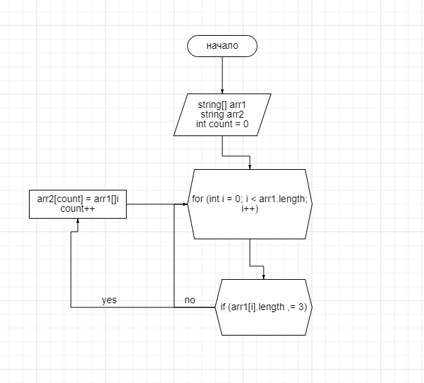

# Задача:
Написать программу, которая из имеющегося массива строк формирует массив из строк, длина которых меньше либо равна 3 символа. Первоначальный массив можно ввести с клавиатуры, либо задать на старте выполнения алгоритма. При решение не рекомендуется пользоваться коллекциями, лучше обойтись исключительно массивами
# Описание алгоритма работы 
* Вводим два массива одной длины.
* Вводим метод, создаем цикл соразмерный длине. массива, этот цикл служит для проверки условия (<=3),если "да", элемент первого массива заносится в count элемент второго массива.
* После присвоения увеличивается переменная count на 1 и возвращается к циклу for в котором i увеличивается на 1.
# Схема 
